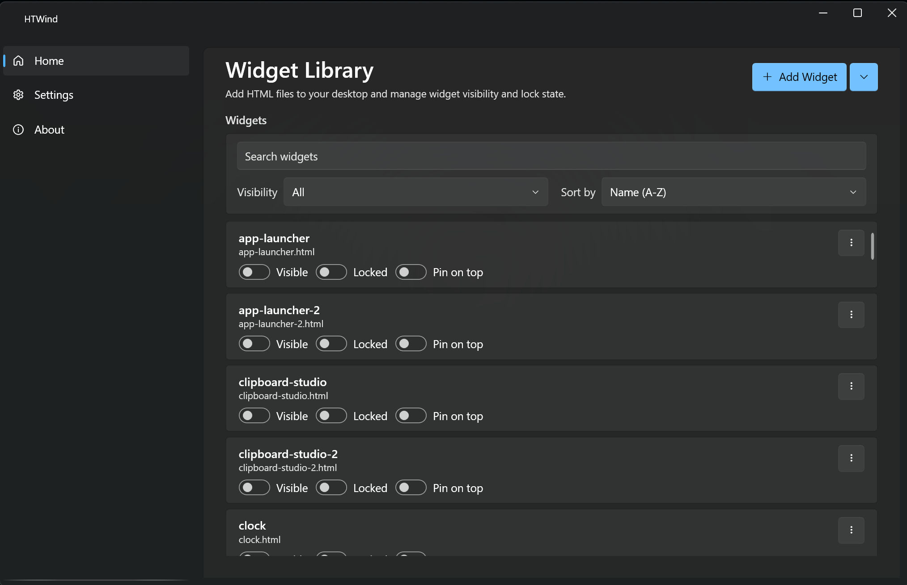
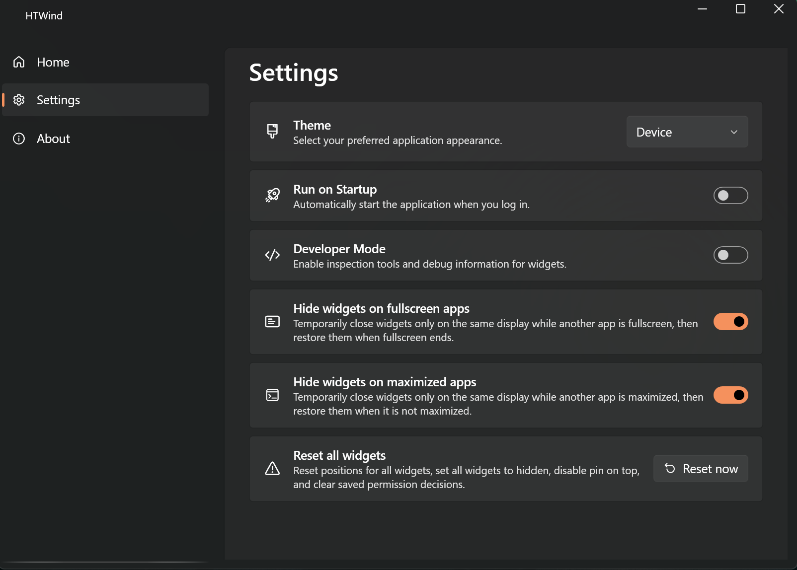
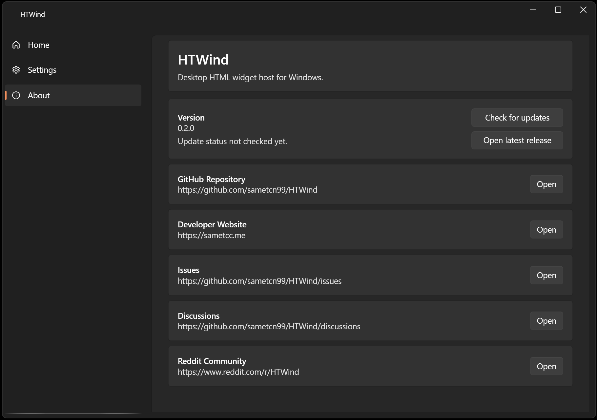

# HTWind

HTWind is a highly customizable, HTML-based widget manager that brings your favorite web tools and system helpers directly to your Windows desktop.
It also supports running PowerShell commands when you need quick system actions.

[Website](https://htwind.vercel.app)

<a href="https://apps.microsoft.com/detail/9PN58CG1P20L?referrer=appbadge&cid=sametcn99&mode=full" target="_blank"  rel="noopener noreferrer">
 
</a>

## Screenshots

<p align="center">
 
 <br/>
 <i>Widget Library - Manage and toggle HTML widgets</i>
</p>

<p align="center">
 
 <br/>
 <i>Settings - Theme and startup configuration</i>
</p>

<p align="center">
 
 <br/>
 <i>About - Version info and project links</i>
</p>

## Highlights

- **Native PowerShell script execution support for system automation and quick tasks**
- Desktop HTML widgets with lock/unlock interaction modes
- Built-in widget library (clock, weather, system tools, file helpers, and more)
- **Widget built-in code editor with live preview (hot reload)**
- Tray integration (show/hide app, background workflow)
- Pin-on-top, visibility toggle, and persisted widget geometry/state
- Smart visibility suppression by display: hide widget windows while another app is fullscreen (toggle)
- Optional maximized-window suppression by display (separate toggle from fullscreen suppression)
- Startup toggle (`HKCU\Software\Microsoft\Windows\CurrentVersion\Run`)
- Localization infrastructure (`resx` + `LocExtension`)
- Built-in code editor with syntax highlighting and live preview (hot reload)
- Open-source and community-driven development

## Visibility Suppression Modes

HTWind includes per-display runtime suppression options in **Settings** to reduce distraction and improve performance while other apps are in focus.

- **Hide widgets on fullscreen apps** (enabled by default):
Widget windows are temporarily closed on the same display when another app enters fullscreen, then restored when fullscreen ends.
- **Hide widgets on maximized apps** (optional):
Widget windows are temporarily closed on the same display when another app is maximized, then restored when that app is no longer maximized.

Notes:

- These options do not change the widget `Visible` state in app data.
- Suppression is runtime-only and windows are restored automatically.

## Share Widgets and Feedback With The Community

Use GitHub Discussions and the HTWind Reddit community to share reusable widgets, desktop setups, bug reports, and feature requests.

- GitHub Discussions: <https://github.com/sametcn99/HTWind/discussions>
- Reddit: <https://www.reddit.com/r/HTWind/>

## Installation

Recommended for most users: install HTWind using the installer executable from GitHub Releases (`HTWind-setup-<version>.exe`).
Portable ZIP and Microsoft Store installation are available as alternatives.

### Option 1: From GitHub Releases (recommended)

1. Open `Releases` in this repository.
2. Download one of the assets:

- `HTWind-setup-<version>.exe` (installer, recommended)
- `HTWind-portable-<version>.zip` (portable alternative)

1. For installer mode, run the setup executable and follow the wizard.

### Option 2: Run from source

Prerequisites:

- Windows 10/11
- .NET SDK 10.0+

Commands:

```powershell
dotnet restore HTWind/HTWind.csproj
dotnet build HTWind/HTWind.csproj
dotnet run --project HTWind/HTWind.csproj
```

## Uninstallation

If you are using the installed version of HTWind, you can uninstall it from **Windows Settings > Apps > Installed apps**.

> [!IMPORTANT]
> Uninstalling HTWind will delete all widgets and data stored in `%LocalAppData%\HTWind`. If you are uninstalling the app to perform a clean update, make sure to take a backup of this folder before proceeding.

## Widget Development

You can build custom widgets using plain HTML/CSS/JavaScript.

### Generate Widgets With LLM Help

If you want AI assistance while creating widgets, use the dedicated HTWind system prompt:

- [HTWind Widget Generator Prompt](chat.prompt.md)
- [HTWind Widget Generator Prompt (shared)](https://prompts.chat/prompts/cmm5broas0004li04ku12tp56_htwind-widget-creator)

You can copy this prompt into your preferred LLM and ask it to generate HTWind-compatible widgets (including PowerShell bridge usage) as a single HTML file.

### Host Bridge API

Widgets can call:

- `window.HTWind.invoke("powershell.exec", args)`

Supported args include:

- `script` (required)
- `timeoutMs`
- `maxOutputChars`
- `shell` (`powershell` or `pwsh`)
- `workingDirectory`

Important:

- Only `powershell.exec` is currently supported.
- Output is clipped by `maxOutputChars` for safety.
- Scripts are executed with `-NoProfile -NonInteractive -ExecutionPolicy Bypass`.

### Security and Responsibility Notice

- HTWind allows widgets to execute PowerShell commands via `powershell.exec`.
- Running commands can modify files, processes, registry entries, and network/system settings.
- All command execution risk is owned by the user running HTWind.
- On first launch, HTWind requires explicit acceptance of this risk before the app opens.

## Contributing

See [CONTRIBUTING.md](CONTRIBUTING.md) for the full contribution guide.

## Support

- Issues: <https://github.com/sametcn99/HTWind/issues>
- Discussions: <https://github.com/sametcn99/HTWind/discussions>
- Reddit community: <https://www.reddit.com/r/HTWind/>

If you find a bug, please include reproduction steps, expected behavior, and environment details.

## License

This project is licensed under the GPL-3.0 License. See the [LICENSE](LICENSE) file for details.
