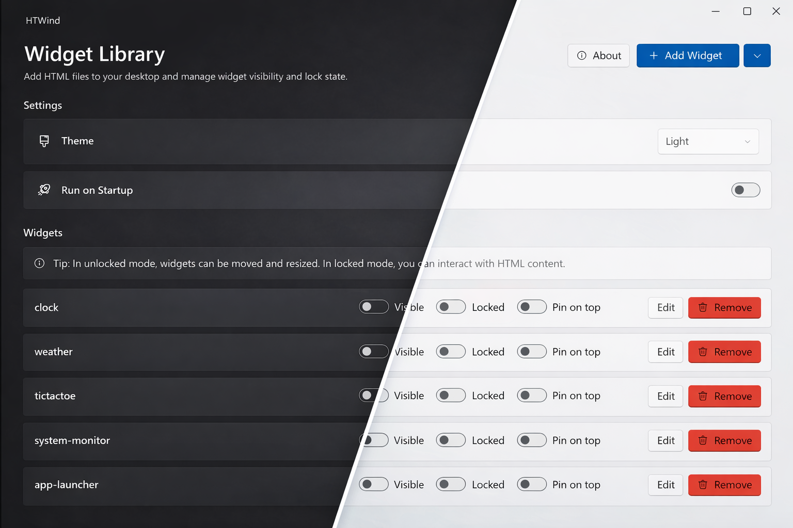

# HTWind

HTWind is a highly customizable, HTML-based widget manager that brings your favorite web tools and system helpers directly to your Windows desktop.
It also supports running PowerShell commands when you need quick system actions.

[Website](https://htwind.vercel.app)

<a href="https://apps.microsoft.com/detail/9PN58CG1P20L?referrer=appbadge&cid=sametcn99&mode=full" target="_blank"  rel="noopener noreferrer">
 
</a>



## Highlights

- **Native PowerShell script execution support for system automation and quick tasks**
- Desktop HTML widgets with lock/unlock interaction modes
- Built-in widget library (clock, weather, system tools, file helpers, and more)
- **Widget built-in code editor with live preview (hot reload)**
- Tray integration (show/hide app, background workflow)
- Pin-on-top, visibility toggle, and persisted widget geometry/state
- Startup toggle (`HKCU\Software\Microsoft\Windows\CurrentVersion\Run`)
- Localization infrastructure (`resx` + `LocExtension`)
- Built-in code editor with syntax highlighting and live preview (hot reload)
- Open-source and community-driven development

## Built-In Widgets

HTWind currently ships with these built-in templates:

- `clock`
- `weather`
- `tictactoe`
- `system-monitor`
- `app-launcher`
- `visualizer`
- `search-box`
- `quick-links`
- `clipboard-studio`
- `system-time`
- `memory-stats`
- `environment-info`
- `network-tools`
- `process-manager`
- `file-explorer`
- `text-file-editor`
- `app-info`
- `media-controls`
- `dns-lookup`
- `file-actions`
- `drive-roots`
- `powershell-console`

Template source files live in `HTWind/Templates`.

## Releases

This repository includes an automated release workflow at:

- `.github/workflows/release.yml`

This workflow can be manually triggered via **GitHub Actions UI** (manual `workflow_dispatch`).

The workflow resolves the current version from `HTWind/HTWind.csproj`, builds the assets, and creates a tagged GitHub Release with:

- Installer (`HTWind-setup-*.exe`) via Inno Setup
- Portable archive (`HTWind-portable-*.zip`)

Both are automatically uploaded to the GitHub Release page as a new release (`v<version>`).

## Installation

### Option 1: From GitHub Releases (recommended)

1. Open `Releases` in this repository.
2. Download one of the assets:

- `HTWind-setup-<version>.exe` (installer)
- `HTWind-portable-<version>.zip` (portable)

1. For installer mode, run the setup executable and follow the wizard.

### Option 2: Run from source

Prerequisites:

- Windows 10/11
- .NET SDK 10.0+

Commands:

```powershell
dotnet restore HTWind/HTWind.csproj
dotnet build HTWind/HTWind.csproj
dotnet run --project HTWind/HTWind.csproj
```

## Uninstallation

If you are using the installed version of HTWind, you can uninstall it from **Windows Settings > Apps > Installed apps**.

> [!IMPORTANT]
> Uninstalling HTWind will delete all widgets and data stored in `%LocalAppData%\HTWind`. If you are uninstalling the app to perform a clean update, make sure to take a backup of this folder before proceeding.

## How To Use

1. Launch HTWind.
2. Add a widget (`Add Widget`) from an HTML file.
3. Use per-widget controls:

- `Visible` to show/hide
- `Locked` to switch between interaction and move/resize mode
- `Pin on top` to keep above other windows
- `Edit` to open the code editor

1. Use tray icon actions for quick show/exit behavior.

## Widget Development

You can build custom widgets using plain HTML/CSS/JavaScript.

### Host Bridge API

Widgets can call:

- `window.HTWind.invoke("powershell.exec", args)`

Supported args include:

- `script` (required)
- `timeoutMs`
- `maxOutputChars`
- `shell` (`powershell` or `pwsh`)
- `workingDirectory`

Important:

- Only `powershell.exec` is currently supported.
- Output is clipped by `maxOutputChars` for safety.
- Scripts are executed with `-NoProfile -NonInteractive -ExecutionPolicy Bypass`.

### Security and Responsibility Notice

- HTWind allows widgets to execute PowerShell commands via `powershell.exec`.
- Running commands can modify files, processes, registry entries, and network/system settings.
- All command execution risk is owned by the user running HTWind.
- On first launch, HTWind requires explicit acceptance of this risk before the app opens.

## Share Widgets and Feedback With The Community

Use GitHub Discussions and the HTWind Reddit community to share reusable widgets, desktop setups, bug reports, and feature requests.

- GitHub Discussions: <https://github.com/sametcn99/HTWind/discussions>
- Reddit: <https://www.reddit.com/r/HTWind/>

Suggested post format:

1. Title: `[Widget] <name>`
2. Summary: what it does
3. Preview: screenshot or short GIF
4. Code: attach `.html` file or paste source
5. Notes: permissions, external APIs, and known limitations
6. Version: compatible HTWind version

You can also share your desktop layout screenshots in Reddit to help others discover practical HTWind setups.

Suggested categories:

- `Widget Showcase`
- `Widget Requests`
- `Widget Help`

Users can copy the shared HTML file and add it through `Add Widget` inside HTWind.

## Contributing

See [CONTRIBUTING.md](CONTRIBUTING.md) for the full contribution guide.

## Support

- Issues: <https://github.com/sametcn99/HTWind/issues>
- Discussions: <https://github.com/sametcn99/HTWind/discussions>
- Reddit community: <https://www.reddit.com/r/HTWind/>

If you find a bug, please include reproduction steps, expected behavior, and environment details.

## License

This project is licensed under the GPL-3.0 License. See the [LICENSE](LICENSE) file for details.
